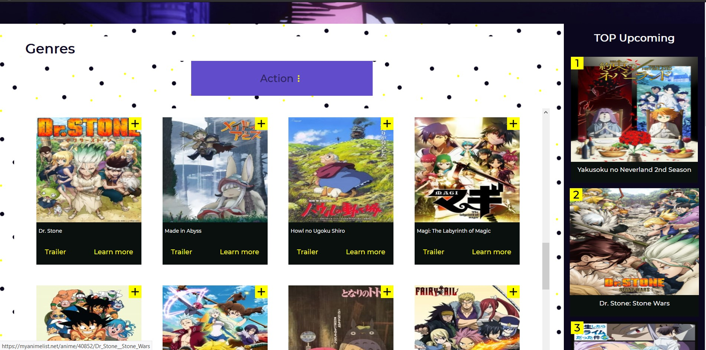

# REACT/FIREBASE anime app



## Description
Anime app built with REACT and FIREBASE and using Graphql and redux. 

You can get and view the list of all products from the API, register, add animes to watchlist and other functionalities .

Live demo on https://react-anime-app.herokuapp.com/

## Technologies & Tools

### Front-end:

* React
* Redux
* Material-UI

### Backend and Databse:

* Node/Express
* Firebase
* GraphQl


## Installation and Usage

### Requirements:

* Node.js installed
* Firebase connection

### Steps:
1. Clone repo on your local machine:
```
```
2. Install server-side dependencies:
```
$ npm install
```
3. Install client-side dependencies:
```
$ cd client
$ npm install
```
4. Create firerbase.js file under src on the client folder and add your firebase config variable
```
// Firebase App (the core Firebase SDK) is always required and
// must be listed before other Firebase SDKs
import firebase from 'firebase';

// Add the Firebase services that you want to use
import "firebase/auth";
import "firebase/firestore";
// Add your firebase config variable
 var firebaseConfig = {
    apiKey: "",
    authDomain: "",
    projectId: "",
    storageBucket: "",
    messagingSenderId: "",
    appId: ""
  };
  // Initialize Firebase
  firebase.initializeApp(firebaseConfig);

const auth = firebase.auth;
const db = firebase.firestore();
export {db,auth}

```


5. Build the app:
```
$ npm run build
```
6. Execute the app:<br/>
```
$ cd ..
$ npm run start
```
8. App now running on ```localhost:5000```
